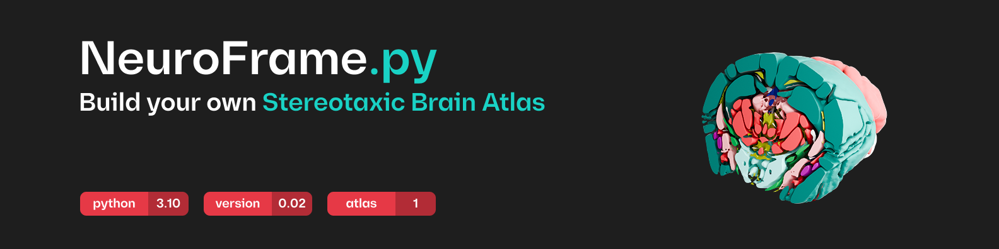
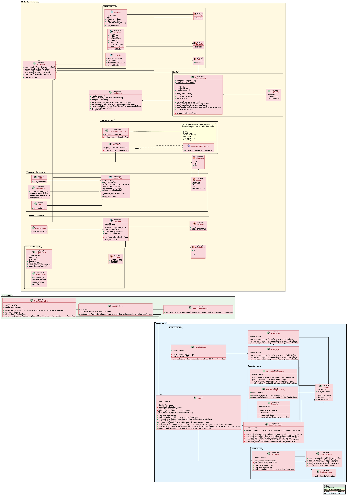

<h1 align='center'>
    NeuroFrame: Build your own Stereotaxic Brain Atlas
</h1>

  by 
  <a href="https://people.epfl.ch/guilherme.henriquesdacostaferreira?lang=en">Guilherme Costa Ferreira</a>,
  <a href="https://people.epfl.ch/guilherme.henriquesdacostaferreira?lang=en">Antoine Philippides</a>,
  and
  <a href="https://people.epfl.ch/guilherme.henriquesdacostaferreira?lang=en">Antoine Collomb-Clerc</a>

    
    
    
    
    

---

## Overview
NeuroFrame is the python package to use when you want to build a Stereotaxic Brain Mouse Atlas for your mice that aren't quite normal. This framework will help you accelerate your research on your favorite niche genetically modified mouse, by allowing precise surgeries! You just need:
- Around 10 of your desired mice
- A full head µCT and MRI
- The respective brain segmentations. For this step refer to [MIRACL](https://github.com/AICONSlab/MIRACL)

## Built Atlas
The foundational project that lead to the creation of this atlas was the one used for the Parkinsonian Mouse Atlas. The results are present at the [website](https://neuroframe.ch/)

## Architecture
The architecture is described here:

